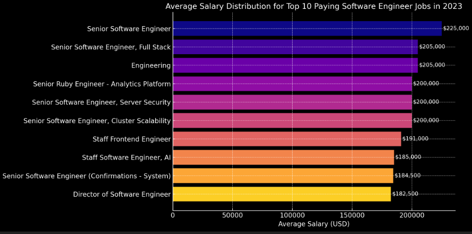
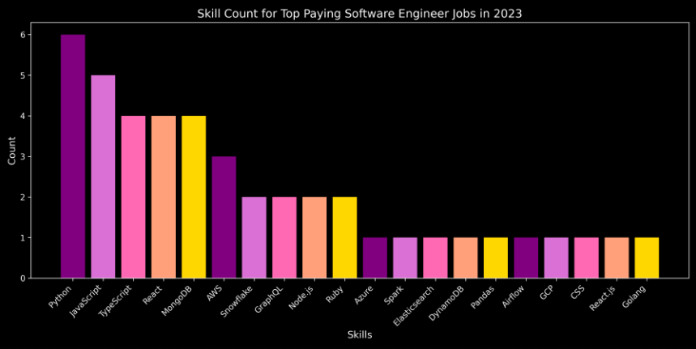

# Introduction 
📊 Dive into the software engineering job market! Focusing on software engineers roles, this project explores 💰 top-paying jobs, 🔥 in-demand skills, and 📈 where high demand meets high salary in software development.

🔍 SQL queries? Check them out here: [project_sql folder](/project_sql/)

# Background
Driven by practicing SQL navigated into the software development job market.

Data hails from this [SQL Course](https://lukebarousse.com/sql).

### The questions answered through SQL queries were:

1. What are the top-paying software engineers jobs?
2. What skills are required for these top-paying jobs?
3. What skills are most in demand for software engineers?
4. Which skills are associated with higher salaries?
5. What are the most optimal skills to learn?

# Tools I Used
For my dive into the software engineer job market, I harnessed the power of several key tools:

- **SQL:** The backbone of the analysis, allowing to query the database and unearth insights.
- **PostgreSQL:** The chosen database management system, for handling the job posting data.
- **Visual Studio Code:** Go-to for database management and executing SQL queries.
- **Git & GitHub:** Essential for version control and sharing my SQL scripts and analysis, ensuring collaboration and project tracking.

# The Analysis
Each query for this project aimed at investigating specific aspects of the software engineering job market. Here’s how I approached each question:

### 1. Top Paying Software Engineer Jobs
To identify the highest-paying roles, I filtered software engineer positions by average yearly salary and location, focusing on remote jobs. This query highlights the high paying opportunities in the field.

```sql
SELECT
    job_id,
    job_title,
    job_location,
    job_schedule_type,
    salary_year_avg,
    job_posted_date,
    name AS company_name
FROM
    job_postings_fact
LEFT JOIN company_dim ON job_postings_fact.company_id = company_dim.company_id
WHERE
    job_title_short = 'Software Engineer' AND
    job_location = 'Anywhere' AND
    salary_year_avg IS NOT NULL
ORDER BY
    salary_year_avg DESC
LIMIT 10
```
Here's the breakdown of the top software engineer jobs in 2023:
- **Salary Distribution:** Most salaries cluster between $180,000 and $205,000, indicating a strong mid-to-high compensation range.
- **Top Outlier:** The highest outlier is $225,000, offered for the Senior Software Engineer role at Datavant.
- **Consistency:** Several roles, especially those at MongoDB, consistently offer $200,000, showing a stable high-paying trend.
- **Specialized Roles:** Titles like Staff Frontend Engineer and AI-focused roles also command high salaries, reflecting demand for niche expertise.


*Bar graph visualizing the salary for the top 10 salaries for software engineers; ChatGPT generated this graph from my SQL query results*

### 2. Skills for Top Paying Jobs
To understand what skills are required for the top-paying jobs, I joined the job postings with the skills data, providing insights into what employers value for high-compensation roles.

```sql
WITH top_paying_jobs AS (
    SELECT
        job_id,
        job_title,
        salary_year_avg,
        name AS company_name
    FROM
        job_postings_fact
    LEFT JOIN company_dim ON job_postings_fact.company_id = company_dim.company_id
    WHERE
        job_title_short = 'Software Engineer' AND
        job_location = 'Anywhere' AND
        salary_year_avg IS NOT NULL
    ORDER BY
        salary_year_avg DESC
    LIMIT 10
)

SELECT 
    top_paying_jobs.*,
    skills
FROM 
    top_paying_jobs
INNER JOIN skills_job_dim ON top_paying_jobs.job_id = skills_job_dim.job_id 
INNER JOIN skills_dim ON skills_job_dim.skill_id = skills_dim.skill_id
ORDER BY
    salary_year_avg DESC
```
Here's the breakdown of the most demanded skills for the top 10 highest paying software engineer jobs in 2023:
- **Python** is the top skill, appearing in 6 out of 10 top-paying job roles. Its dominance reflects its versatility in full-stack development, data engineering, and AI.
- **Cloud expertise is crucial.** AWS is present in 4 of the top-paying roles. Azure and GCP appear less frequently but still show relevance. Cloud skills are increasingly associated with high-compensation roles.
- **Data Engineering & Big Data Tools.** Tools like Snowflake, Airflow, Spark, and DynamoDB are valued, showing demand for data pipeline and data warehousing knowledge.
- **Frontend frameworks matter too.** React appears in 4 roles. TypeScript and JavaScript are equally important, especially for full-stack and frontend-heavy positions.
- **Specialized tools.** GraphQL, Elasticsearch, Pandas, and Node.js were each found in multiple high-paying roles, underscoring the need for engineers to be fluent in API and data-driven technologies.



*Bar graph visualizing the count of skills for the top 10 paying jobs for software engineers; Copilot generated this graph from my SQL query results*

### 3. In-Demand Skills for Software Engineers

This query helped identify the skills most frequently requested in job postings, directing focus to areas with high demand.

```sql
SELECT 
    skills,
    COUNT(skills_job_dim.job_id) AS demand_count
FROM job_postings_fact
INNER JOIN skills_job_dim ON job_postings_fact.job_id = skills_job_dim.job_id 
INNER JOIN skills_dim ON skills_job_dim.skill_id = skills_dim.skill_id
WHERE
    job_title_short = 'Software Engineer' AND
    job_work_from_home = True
GROUP BY
    skills
ORDER BY
    demand_count DESC
LIMIT 5
```

Here's the breakdown of the most demanded skills for software engineers in 2023
- **Data & cloud skills dominate:** Python, SQL, and AWS are top-tier.
- **DevOps is rising:** Kubernetes shows strong infrastructure demand.
- **Versatility matters:** Combining coding, data, and cloud boosts value.

| Skill      | Demand Count |
| ---------- | ------------ |
| Python     | 1318         |
| SQL        | 1038         |
| AWS        | 1007         |
| Java       | 741          |
| Kubernetes | 618          |
*Table of the demand for the top 5 skills in software engineer job postings*

### 4. Skills Based on Salary
Exploring the average salaries associated with different skills revealed which skills are the highest paying.

```sql
SELECT 
    skills,
    ROUND(AVG(salary_year_avg), 2) AS avg_salary
FROM job_postings_fact
INNER JOIN skills_job_dim ON job_postings_fact.job_id = skills_job_dim.job_id 
INNER JOIN skills_dim ON skills_job_dim.skill_id = skills_dim.skill_id
WHERE
    job_title_short = 'Software Engineer' 
    AND salary_year_avg IS NOT NULL
    AND job_work_from_home = True
GROUP BY
    skills
ORDER BY
    avg_salary DESC
LIMIT 25
```
Here's a breakdown of the results for top paying skills for Software Engineers:
- **Specialized Databases = High Pay.** Tools like DynamoDB, Couchbase, Snowflake, Neo4j, MongoDB command top salaries (up to $184k). Reflects demand for scalable, modern NoSQL and graph databases in big data and real-time systems.

- **Data Engineering & Analytics in Demand.** Skills like Airflow, Pandas, Snowflake, Elasticsearch, Looker, Numpy are highly paid. Indicates strong investment in data pipelines, ML ops, and analytics platforms.

- **Backend Development Remains Lucrative.** Languages like C, C++, ASP.NET, ASP.NET Core offer high salaries.
Especially valuable in enterprise, system-level, and high-performance applications.

- **Full-Stack & Front-End Still Strong.** Frameworks like React, Angular, TypeScript, JQuery are well-compensated. Shows continued demand for modern JavaScript and full-stack developers.

- **DevOps & Cloud Skills Boost Earnings.** Tools like Ansible, Jenkins, Azure are associated with higher pay. Emphasizes value in automation and cloud-native development.

- **Legacy Tech Still Pays.** Older skills like HTML, Ruby, Oracle still appear in high-paying roles. Suggests a niche for maintaining or modernizing legacy systems.

| #  | Skill         | Average Salary (USD) |
| -- | ------------- | -------------------- |
| 1  | dynamodb      | \$184,000.00         |
| 2  | couchbase     | \$182,500.00         |
| 3  | c             | \$174,500.00         |
| 4  | snowflake     | \$169,000.00         |
| 5  | pandas        | \$168,833.33         |
| 6  | asp.net       | \$168,750.00         |
| 7  | airflow       | \$165,375.00         |
| 8  | react         | \$156,222.22         |
| 9  | angular       | \$155,000.00         |
| 10 | ansible       | \$155,000.00         |
| 11 | jquery        | \$155,000.00         |
| 12 | asp.net core  | \$155,000.00         |
| 13 | neo4j         | \$155,000.00         |
| 14 | mongo         | \$155,000.00         |
| 15 | elasticsearch | \$154,500.00         |
| 16 | looker        | \$150,000.00         |
| 17 | flow          | \$150,000.00         |
| 18 | azure         | \$149,777.78         |
| 19 | ruby          | \$143,800.00         |
| 20 | html          | \$143,750.00         |
| 21 | c++           | \$143,500.00         |
| 22 | oracle        | \$143,333.33         |
| 23 | typescript    | \$142,142.86         |
| 24 | jenkins       | \$140,833.33         |
| 25 | numpy         | \$140,500.00         |
*Table of the average salary for the top 10 paying skills for software engineers*

### 5. Most Optimal Skills to Learn

Combining insights from demand and salary data, this query aimed to pinpoint skills that are both in high demand and have high salaries, offering a strategic focus for skill development.

```sql
SELECT  
    skills_dim.skill_id,
    skills_dim.skills,
    COUNT(skills_job_dim.job_id) AS demand_count,
    ROUND(AVG(job_postings_fact.salary_year_avg), 2) AS avg_salary
FROM
    job_postings_fact
INNER JOIN skills_job_dim ON job_postings_fact.job_id = skills_job_dim.job_id
INNER JOIN skills_dim ON skills_job_dim.skill_id = skills_dim.skill_id
WHERE
    job_title_short = 'Software Engineer'
    AND salary_year_avg IS NOT NULL
    AND job_work_from_home = True
GROUP BY
    skills_dim.skill_id
HAVING
    COUNT(skills_job_dim.job_id) > 10
ORDER BY
    avg_salary DESC,
    demand_count DESC
LIMIT 25;
```

| # | Skill      | Demand Count | Avg. Salary (USD) |
| - | ---------- | ------------ | ----------------- |
| 1 | Python     | 32           | \$132,265.63      |
| 2 | SQL        | 30           | \$112,728.53      |
| 3 | AWS        | 21           | \$125,142.86      |
| 4 | JavaScript | 16           | \$137,000.00      |
| 5 | TypeScript | 14           | \$142,142.86      |
| 6 | Docker     | 13           | \$94,307.69       |
| 7 | GCP        | 11           | \$128,350.55      |
*Table of the most optimal skills for software engineers sorted by salary*

Here's a breakdown of the most optimal skills for Software Engineers in 2023: 
- **Python and SQL** lead in demand (32 and 30 listings), indicating they're foundational in the current job market.
- **TypeScript** offers the highest average salary ($142K), despite moderate demand—suggesting niche expertise is well-rewarded.
- **Cloud platforms** like AWS and GCP remain valuable, with strong average salaries and decent demand.
- **Docker**, while essential in DevOps, shows lower average salary ($94K) compared to others—possibly due to broader accessibility or commoditization.

# Conclusions
### Insights
From the analysis, several general insights emerged:

1. **Top-Paying Software Engineer Jobs**: The highest-paying jobs for software engineers that allow remote work offer a wide range of salaries, the highest at $225,000.
2. **Skills for Top-Paying Jobs**: High-paying roles most commonly demand Python, cloud expertise (like AWS), and modern frontend frameworks such as React. Employers value full-stack, cloud-native, and data-driven development skills.
3. **Most In-Demand Skills**: **Python**, **SQL**, and **AWS** dominate job postings, proving indispensable for aspiring engineers. The demand also shows an increased focus on scalable data solutions and DevOps tools like **Kubernetes**.
4. **Skills with Higher Salaries**: Specialized and modern tech stacks command premium salaries. Tools like **DynamoDB**, **Couchbase**, and **Snowflake** lead in average pay, reflecting the value of niche, high-performance, and big data technologies.
5. **Optimal Skills for Job Market Value**: Combining **high demand** with **high salary**, tools like **Python**, **SQL**, **React**, **Snowflake**, and **Airflow** emerge as the most strategic skills to learn, maximizing both employability and earning potential in the remote software engineering market.